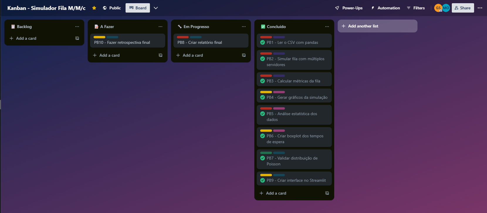

# 🧮 Simulação de Filas M/M/c - Projeto Interdisciplinar


## 📊 Status do Projeto

O projeto está atualmente em desenvolvimento ativo, com as funcionalidades principais implementadas e em fase de testes e melhorias.

## 🎯 Objetivo

Desenvolver uma aplicação em Python para simular o comportamento de um sistema de filas com múltiplos servidores (modelo M/M/c), utilizando dados simulados e reais. O sistema foi projetado para analisar desempenho, prever gargalos e apoiar decisões operacionais em contextos como clínicas, restaurantes ou centrais de suporte.

Este projeto é interdisciplinar, integrando conhecimentos de:

- Engenharia de Software
- Estatística
- Pesquisa Operacional


## 🚀 Como Executar

### Pré-requisitos:
- Python 3.10+
- Bibliotecas:
  - pandas >= 2.0.0
  - matplotlib >= 3.7.0
  - numpy >= 1.24.0
  - scipy >= 1.10.0
  - flask >= 2.3.0

### Passos:
1. Clone o repositório ou extraia os arquivos.
2. Instale as dependências executando:
   ```powershell
   pip install -r requirements.txt
   ```
3. Para rodar o sistema:
   ```powershell
   python src/main.py
   ```
4. Acesse a interface local pelo navegador: http://localhost:5000
5. Configure os parâmetros da simulação:
   - Número de Postos: define quantos postos de vacinação estão disponíveis
   - Nível de Confiança: escolha entre 90%, 95% ou 99% para os intervalos de confiança

### Estrutura de Desenvolvimento
O projeto está organizado de forma modular para facilitar a manutenção e extensão:

- `src/models/`: Contém a lógica central da simulação de filas
- `src/services/`: Implementa os serviços de análise estatística
- `static/` e `templates/`: Interface web da aplicação
- `assets/`: Armazena recursos como os dados de entrada e os resultados
- `assets/graphs`: Armazena os gráficos gerados


## 🖼️ Print do Kanban no Trello

### 🎨 Legenda das Labels

| Cor         | Label             | Significado                       |
|-------------|-------------------|-----------------------------------|
| Vermelho    | Prioridade Alta   | Tarefas críticas e prioritárias   |
| Amarelo     | Prioridade Média  | Importantes, mas não urgentes     |
| Verde       | Prioridade Baixa  | Tarefas que podem esperar         |
| Roxo        | Sprint 1          | Atividades da primeira sprint     |
| Rosa        | Sprint 2          | Atividades da segunda sprint      |
| Azul Suave  | Sprint 3          | Atividades da terceira sprint     |

Abaixo, a visualização do quadro com as tarefas divididas por status:




## 📁 Estrutura do Projeto

```
📦 Simulador Fila MMc
├── 📂 src/                           # Código fonte do projeto
│   ├── 📜 main.py                    # Ponto de entrada e rotas Flask
│   ├── 📂 models/                    # Classes e modelos de dados
│   │   └── 📜 simulacao_filas.py     # Lógica de simulação M/M/c
│   └── 📂 services/                  # Serviços e lógica de negócio
│       └── 📜 analise_estatistica.py # Cálculos e análises estatísticas
├── 📂 templates/                     # Templates HTML
│   └── 📜 index.html                 # Interface principal
├── 📂 static/                        # Arquivos estáticos
│   ├── 📜 favicon.ico                # Ícone da aplicação
│   ├── 📂 css/                       # Estilos
│   │   └── 📜 style.css              # CSS principal
│   └── 📂 js/                        # JavaScript
│       └── 📜 main.js                # Lógica do frontend
├── 📂 assets/                        # Recursos
│   ├── 📜 dados_atendimento.csv      # Dados de simulação
│   └── 📂 prints/                    # Imagens do Kanban do projeto
│   └── 📂 graphs/                    # Armazena os gráficos gerados
│       └── 📊 graficos_*.png         # Gráficos gerados
├── 📜 requirements.txt               # Dependências do projeto
├── 📜 README.md                      # Esta documentação
└── 📜 LICENSE                        # Licença MIT
```

## 👥 Equipe

| Nome Completo                    | Papel / Responsabilidades                            |
|----------------------------------|------------------------------------------------------|
| Artur Rossi Junior               | Documentação e simulação                             |
| Gustavo Correa Pedro de Carvalho | Cálculos estatísticos e métricas                     |
| Gustavo Correia Scarabeli        | Integração Flask, interface, gráficos e visualizações|
| Matheus Andrade de Oliveira      | Organização do projeto e relatórios finais           |


## 📊 Tarefas por disciplina

### 🛠 Engenharia de Software
- Definição de papéis do Scrum (PO, SM, Dev Team)
- Criação do Product Backlog com 10+ tarefas
- Planejamento por Sprint (1 a 3)
- Organização visual com Kanban no Trello
- Participação nas cerimônias Scrum simuladas
- Relatório com evidências do processo de desenvolvimento
- Estrutura e documentação do projeto

### 🔢 Pesquisa Operacional
- Leitura e uso de dados simulados de chegada e atendimento
- Simulação do sistema de filas M/M/c com múltiplos servidores
- Cálculo das métricas de desempenho do sistema:
  - P₀: Probabilidade do sistema vazio
  - P<sub>espera</sub>: Probabilidade de espera
  - L<sub>q</sub>, W<sub>q</sub>, L, W
- Geração de gráficos para:
  - Tempo de espera por cliente
  - Tamanho da fila ao longo do tempo
  - Ocupação dos servidores
- Análise de cenários: adicionar servidor ou aumentar μ

### 📈 Estatística
- Cálculo de medidas descritivas:
  - Média, mediana, moda, variância, desvio padrão
- Visualização dos dados:
  - Histogramas lado a lado para tempos de atendimento e chegadas
  - Boxplot comparativo em visualização separada
- Inferência estatística:
  - Intervalos de confiança (90%, 95%, 99%) para as médias dos tempos
- Formatação numérica adaptada ao padrão brasileiro (vírgula como separador decimal)


## 🌟 Features Atuais

### 📊 Análise Estatística
- Cálculo de medidas descritivas:
  - Média, mediana, moda, variância, desvio padrão
- Visualização dos dados:
  - Histogramas lado a lado para tempos de atendimento e chegadas
  - Boxplot comparativo em visualização separada
- Inferência estatística:
  - Intervalos de confiança (90%, 95%, 99%) para as médias dos tempos
- Formatação numérica adaptada ao padrão brasileiro (vírgula como separador decimal)

### 🔄 Simulação
- Simulação do sistema de filas M/M/c com múltiplos servidores
- Cálculo das métricas de desempenho do sistema:
  - P₀: Probabilidade do sistema vazio
  - P<sub>espera</sub>: Probabilidade de espera
  - L<sub>q</sub>, W<sub>q</sub>, L, W
- Geração de gráficos para:
  - Tempo de espera por cliente
  - Tamanho da fila ao longo do tempo
  - Ocupação dos servidores
- Análise de cenários: adicionar servidor ou aumentar μ

### 💻 Interface e Usabilidade
- Interface web responsiva com tema dark mode
- Seleção dinâmica do nível de confiança (90%, 95%, 99%)
- Configuração flexível do número de servidores
- Visualizações otimizadas com layout aprimorado
- Indicador de carregamento durante processamento


## 📌 Observações

Este projeto foi desenvolvido como parte da avaliação interdisciplinar do 2º bimestre do curso, integrando as disciplinas de Engenharia de Software, Estatística e Pesquisa Operacional.

A aplicação simula o comportamento de filas com múltiplos servidores (modelo M/M/c) utilizando dados reais ou simulados. Também realiza análises estatísticas e oferece visualizações úteis para avaliação de desempenho do sistema.

O código está modularizado, com separação entre simulação, análise estatística e interface. O projeto está preparado para futuras expansões, como:

- Integração com dashboard via Streamlit
- Análise de sensibilidade com diferentes parâmetros
- Uso de dados reais de empresas parceiras

## ⚠️ Limitações Conhecidas

- A simulação atual está otimizada para até 10 servidores
- Os intervalos de confiança são calculados assumindo normalidade dos dados
- A interface web não possui suporte para dispositivos móveis muito pequenos
- Os dados simulados são gerados com distribuição exponencial apenas

## 🤝 Contribuição

Para contribuir com o projeto:

1. Faça um fork do repositório
2. Crie uma branch para sua feature (`git checkout -b feature/NovaFeature`)
3. Faça commit das mudanças (`git commit -m 'Adiciona nova feature'`)
4. Push para a branch (`git push origin feature/NovaFeature`)
5. Abra um Pull Request

## 📝 Licença

Este projeto está sob a licença MIT. Veja o arquivo [LICENSE](LICENSE) para mais detalhes.

