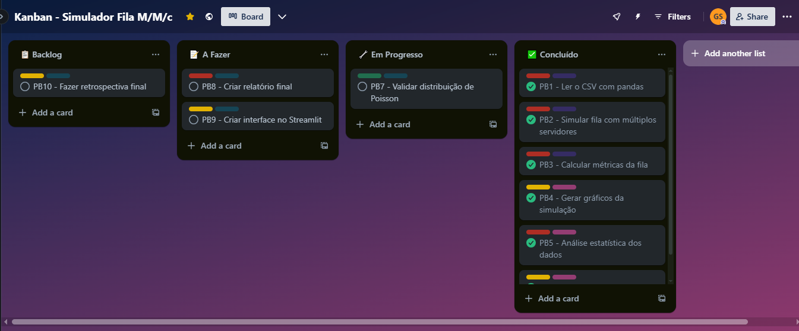

# 🧮 Simulação de Filas M/M/c - Projeto Interdisciplinar

## 🎯 Objetivo

Desenvolver uma aplicação em Python para simular o comportamento de um sistema de filas com múltiplos servidores (modelo M/M/c), utilizando dados simulados e reais. O sistema foi projetado para analisar desempenho, prever gargalos e apoiar decisões operacionais em contextos como clínicas, restaurantes ou centrais de suporte.

Este projeto é interdisciplinar, integrando conhecimentos de:

- Engenharia de Software
- Estatística
- Pesquisa Operacional


## 🚀 Como Executar

### Pré-requisitos:
- Python 3.10+
- Bibliotecas:
  - pandas
  - matplotlib
  - numpy
  - scipy
  - flask

### Passos:
1. Clone o repositório ou extraia os arquivos.
2. Instale as dependências executando:
   ```powershell
   pip install pandas matplotlib numpy scipy flask
   ```
3. Para rodar o sistema:
   ```powershell
   python main.py
   ```
4. Acesse a interface local pelo navegador: http://localhost:5000
5. Configure os parâmetros da simulação:
   - Número de Servidores: define quantos atendentes estão disponíveis
   - Nível de Confiança: escolha entre 90%, 95% ou 99% para os intervalos de confiança


## 🖼️ Print do Kanban no Trello

### 🎨 Legenda das Labels

| Cor         | Label             | Significado                       |
|-------------|-------------------|-----------------------------------|
| Vermelho    | Prioridade Alta   | Tarefas críticas e prioritárias   |
| Amarelo     | Prioridade Média  | Importantes, mas não urgentes     |
| Verde       | Prioridade Baixa  | Tarefas que podem esperar         |
| Roxo        | Sprint 1          | Atividades da primeira sprint     |
| Rosa        | Sprint 2          | Atividades da segunda sprint      |
| Azul Suave  | Sprint 3          | Atividades da terceira sprint     |

Abaixo, a visualização do quadro com as tarefas divididas por status:




## 📁 Estrutura do Projeto

```
📦 Simulador Fila MMc
├── 📜 main.py                    # Script principal e rotas Flask
├── 📜 simulacao_filas.py         # Lógica de simulação M/M/c
├── 📜 analise_estatistica.py     # Cálculos e análises estatísticas
├── 📂 templates/                 # Templates HTML
│   └── 📜 index.html            # Interface principal
├── 📂 static/                    # Arquivos estáticos
│   ├── 📜 favicon.ico           # Ícone da aplicação
│   ├── 📂 css/                  # Estilos
│   │   └── 📜 style.css        # CSS principal
│   └── 📂 js/                   # JavaScript
│       └── 📜 main.js          # Lógica do frontend
└── 📂 assets/                    # Recursos
    ├── 📜 dados_atendimento.csv # Dados de simulação
    ├── 📊 graficos_*.png        # Gráficos gerados
    └── 📂 prints/               # Imagens do projeto
```

## 👥 Equipe

| Nome Completo                    | Papel / Responsabilidades                            |
|----------------------------------|------------------------------------------------------|
| Artur Rossi Junior               | Documentação e simulação                             |
| Gustavo Correa Pedro de Carvalho | Cálculos estatísticos e métricas                     |
| Gustavo Correia Scarabeli        | Integração Flask, interface, gráficos e visualizações|
| Matheus Andrade de Oliveira      | Organização do projeto e relatórios finais           |


## 📊 Tarefas por disciplina

### 🛠 Engenharia de Software
- Definição de papéis do Scrum (PO, SM, Dev Team)
- Criação do Product Backlog com 10+ tarefas
- Planejamento por Sprint (1 a 3)
- Organização visual com Kanban no Trello
- Participação nas cerimônias Scrum simuladas
- Relatório com evidências do processo de desenvolvimento
- Estrutura e documentação do projeto

### 🔢 Pesquisa Operacional
- Leitura e uso de dados simulados de chegada e atendimento
- Simulação do sistema de filas M/M/c com múltiplos servidores
- Cálculo das métricas de desempenho do sistema:
  - P₀: Probabilidade do sistema vazio
  - P<sub>espera</sub>: Probabilidade de espera
  - L<sub>q</sub>, W<sub>q</sub>, L, W
- Geração de gráficos para:
  - Tempo de espera por cliente
  - Tamanho da fila ao longo do tempo
  - Ocupação dos servidores
- Análise de cenários: adicionar servidor ou aumentar μ

### 📈 Estatística
- Cálculo de medidas descritivas:
  - Média, mediana, moda, variância, desvio padrão
- Visualização dos dados:
  - Histogramas lado a lado para tempos de atendimento e chegadas
  - Boxplot comparativo em visualização separada
- Inferência estatística:
  - Intervalos de confiança (90%, 95%, 99%) para as médias dos tempos
- Formatação numérica adaptada ao padrão brasileiro (vírgula como separador decimal)


## 🌟 Features Atuais

### 📊 Análise Estatística
- Cálculo de medidas descritivas:
  - Média, mediana, moda, variância, desvio padrão
- Visualização dos dados:
  - Histogramas lado a lado para tempos de atendimento e chegadas
  - Boxplot comparativo em visualização separada
- Inferência estatística:
  - Intervalos de confiança (90%, 95%, 99%) para as médias dos tempos
- Formatação numérica adaptada ao padrão brasileiro (vírgula como separador decimal)

### 🔄 Simulação
- Simulação do sistema de filas M/M/c com múltiplos servidores
- Cálculo das métricas de desempenho do sistema:
  - P₀: Probabilidade do sistema vazio
  - P<sub>espera</sub>: Probabilidade de espera
  - L<sub>q</sub>, W<sub>q</sub>, L, W
- Geração de gráficos para:
  - Tempo de espera por cliente
  - Tamanho da fila ao longo do tempo
  - Ocupação dos servidores
- Análise de cenários: adicionar servidor ou aumentar μ

### 💻 Interface e Usabilidade
- Interface web responsiva com tema dark mode
- Seleção dinâmica do nível de confiança (90%, 95%, 99%)
- Configuração flexível do número de servidores
- Visualizações otimizadas com layout aprimorado
- Indicador de carregamento durante processamento


## 📌 Observações

Este projeto foi desenvolvido como parte da avaliação interdisciplinar do 2º bimestre do curso, integrando as disciplinas de Engenharia de Software, Estatística e Pesquisa Operacional.

A aplicação simula o comportamento de filas com múltiplos servidores (modelo M/M/c) utilizando dados reais ou simulados. Também realiza análises estatísticas e oferece visualizações úteis para avaliação de desempenho do sistema.

O código está modularizado, com separação entre simulação, análise estatística e interface. O projeto está preparado para futuras expansões, como:

- Integração com dashboard via Streamlit
- Análise de sensibilidade com diferentes parâmetros
- Uso de dados reais de empresas parceiras

